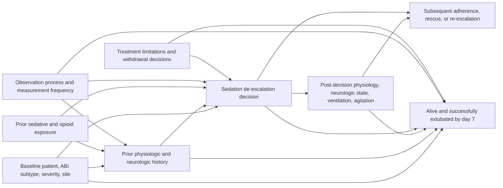

# WHEN-TO-WAKE ABI Causal Diagram v1.0

Frozen: 2026-08-02

Interpretation:

- `H` contains time-varying confounders affected by prior treatment, so ordinary baseline adjustment is insufficient.
- Variables in `L` are not adjusted as baseline covariates for the initial treatment action; they enter later adherence/censoring models.
- Successful SBT/extubation readiness is a downstream/neighboring decision. When recorded before time zero it is an eligibility/confounding variable; after time zero it may be on the causal pathway and is not adjusted as a baseline covariate.
- ICP monitoring is partly determined by severity and practice. Absence of monitoring is not encoded as normal ICP.
- Treatment limitation/withdrawal is a major potential source of confounding and informative outcome processes; it is included when measurable and addressed by sensitivity analysis.
